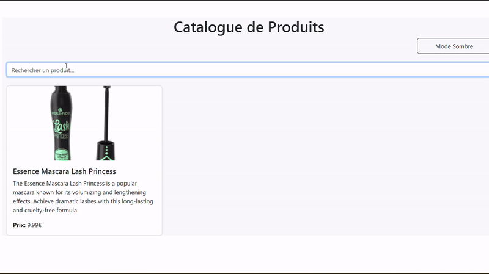
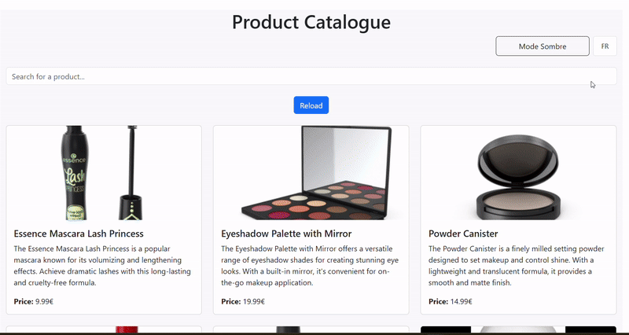

# TP React Hooks - Application de Gestion de Produits

Ce TP a pour objectif de mettre en pratique l'utilisation des Hooks React (useState, useEffect, useContext) ainsi que la création de Hooks personnalisés.

## Installation et configuration initiale

1. Cloner le dépôt :
```bash
git clone https://github.com/pr-daaif/tp-react-hooks.git
cd tp-react-hooks
```

2. Créer votre propre dépôt sur Github et changer le remote :
```bash
# Supprimer le remote origine
git remote remove origin

# Ajouter votre nouveau remote
git remote add origin https://github.com/[votre-username]/tp-react-hooks.git

# Premier push
git push -u origin main
```

3. Installer les dépendances :
```bash
npm install
```

4. Lancer l'application :
```bash
npm start
```

## Instructions pour le TP

Pour chaque exercice :
1. Lisez attentivement l'énoncé
2. Implémentez la solution
3. Testez votre implémentation (pensez à faire des copies d'écran)
4. Mettez à jour la section correspondante dans ce README avec :
   - Une brève explication de votre solution
   - Des captures d'écran montrant le fonctionnement
   - Les difficultés rencontrées et comment vous les avez résolues
5. Commitez vos changements avec un message descriptif

### Exercice 1 : État et Effets 
#### Objectif : Implémenter une recherche en temps réel

- [x] 1.1 Modifier le composant ProductSearch pour utiliser la recherche
- [x] 1.2 Implémenter le debounce sur la recherche
- [x] 1.3 Documenter votre solution ici

_Votre réponse pour l'exercice 1 :_
```
Hook useDebounce : Gère les requêtes API en retardant l'appel jusqu'à ce que l'utilisateur arrête de taper pendant 500ms.
Composant ProductSearch : Utilise ce hook pour capter le terme de recherche et déclencher l'appel API.
Requête API dans useProductSearch : Effectue une recherche basée sur le terme saisi.
```



### Exercice 2 : Context et Internationalisation
#### Objectif : Gérer les préférences de langue

- [x] 2.1 Créer le LanguageContext
- [x] 2.2 Ajouter le sélecteur de langue
- [x] 2.3 Documenter votre solution ici

_Votre réponse pour l'exercice 2 :_
```
- `LanguageContext`: Un contexte React a été créé pour gérer la langue de l'application.
- Sélecteur de langue: Un composant `LanguageSelector` permet de changer la langue entre "en" et "fr". Lorsqu'un utilisateur clique, l'état de la langue est mis à jour, ce qui déclenche un changement global de langue.
- Mise en œuvre de l'internationalisation: Le changement de langue affecte le texte et les composants de l'interface utilisateur.
```


### Exercice 3 : Hooks Personnalisés
#### Objectif : Créer des hooks réutilisables

- [x] 3.1 Créer le hook useDebounce
- [x] 3.2 Créer le hook useLocalStorage
- [x] 3.3 Documenter votre solution ici

_Votre réponse pour l'exercice 3 :_
```
J’ai ajouté useLocalStorage pour conserver la langue sélectionnée.
```

### Exercice 4 : Gestion Asynchrone et Pagination
#### Objectif : Gérer le chargement et la pagination

- [x] 4.1 Ajouter le bouton de rechargement
- [x] 4.2 Implémenter la pagination
- [x] 4.3 Documenter votre solution ici

_Votre réponse pour l'exercice 4 :_
```
La solution consiste en l'utilisation des paramètres limit et skip fournis par l'API pour implémenter la pagination.
```
